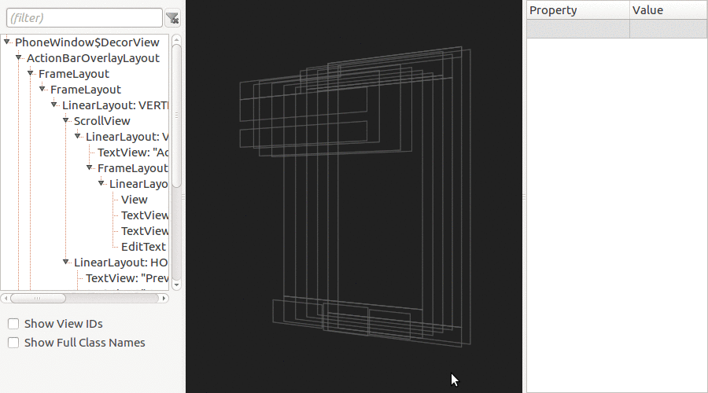

# Androli

Explore the view layout of Android apps in 3D.

Androli is a cross-platform, experimental tool written in Object Pascal.

## Features

- Inspect any active Android window
- Inspect Device Monitor dump files
- 3D view with image of common UI widgets
- Filterable and customizable tree view
- Inspect view properties
- Rotate/scale/pan
- Hide/show/collapse/expand layout sections
- Clip views to parent
- Easy installation, just copy/launch a binary

## Installing

### Pre-compiled

Download the latest release package from the [releases page](../../releases), unpack, copy somewhere on your system and you're good to go.

### From source

1. Clone this repository
2. Install [Lazarus 1.6.2](http://www.lazarus-ide.org/)
3. Compile

## Prerequisites

1. Install [Android SDK Platform Tools](https://developer.android.com/studio/releases/platform-tools.html)
2. Start [ADB](https://developer.android.com/studio/command-line/adb.html) server with: 
`adb start-server`

## Getting Started

1. Launch Androli's binary
2. From `File` menu select `Open Dump File` or `Open Device Window`
3. Explore the view layout and its properties.

## Known Limitations

Androli works only on emulators and rooted devices.

## Authors

1. **Albert Almeida** - Placatan de la Bugulandia Rey - [caviola](https://github.com/caviola)

## License

This project is licensed under the [MIT License](LICENSE).

## Hire Me!

I'm based in Pembroke Pines (FL). I'm a process-oriented, no-silver-bullet, tinkerer kind-of-guy. If you think we may have common values/vision and might be a good fit in your team don't hesitate to drop me a line. This is my [LinkedIn profile](https://www.linkedin.com/in/elmago).
