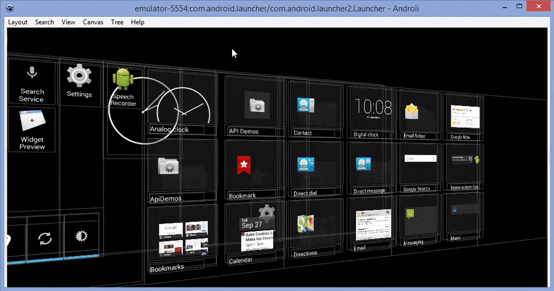

# Androli

Explore the view layout of Android apps in 3D.

Androli is a cross-platform, experimental tool developed with [Lazarus](http://www.lazarus-ide.org/).

## Features

- Inspect any active Android window
- Inspect Device Monitor dump files
- 2D/3D view modes
- Focus on any layout branch; navigate focus history
- Filterable and customizable tree view
- View property inspector
- Save/restore the workspace state (Bookmarks)
- Portable installation

## Installing

### Pre-compiled

Download the latest release package from the [releases page](../../releases), unpack, copy somewhere on your system and you're good to go.

### From source

1. Install [Lazarus 1.6.4](http://www.lazarus-ide.org/)
2. Install [MultiLog](https://github.com/blikblum/multilog)
3. Clone this repository
4. Compile

## Prerequisites

1. Install [Android SDK Platform Tools](https://developer.android.com/studio/releases/platform-tools.html)
2. Start [ADB](https://developer.android.com/studio/command-line/adb.html) server with: 
`adb start-server`

## Getting Started

1. Launch Androli's binary
2. From `File` menu select `Open Dump File` or `Open View Server Window`
3. Explore the view layout.

## Known Limitations

Androli works only on emulators and rooted devices.

## Authors

1. **Albert Almeida** - Placatan de la Bugulandia Rey - [caviola](https://github.com/caviola)

## License

This project is licensed under the [MIT License](LICENSE).

## Hire Me!
